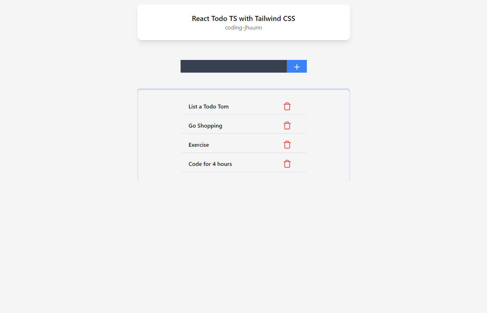

<h1>React + TS + Tailwind CSS</h1>

<h2>Output Design</h2>

<h2>Features</h2>
<li>validate form if input is empty</li>
<li>validate input if already exist</li>
<li>save and retrieve data from Local Web Storage</li>

--this is my version 2 of React Todo
